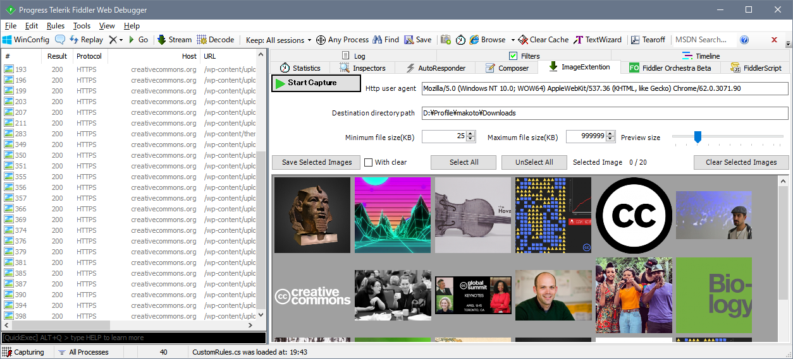
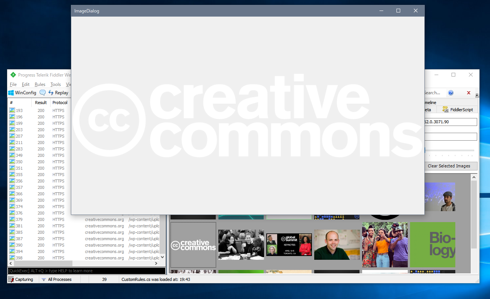

# FiddlerImageFileExension

*This is an extension to check and download image files using "Fiddler".*

## Overview

- Function
	- Save all the images selected in the image preview to a file.

- Other
	- Change request headers user-agent.
	- Specify where to save the image.
	- Get image preview by filtering by file size.
	- Enable scaling in image preview.
	- When saving images, can choose whether to delete from the preview.

## Usage

### Setup

1. Install [fiddler](https://www.telerik.com/fiddler).
1. git clone this project.
1. Build this project and create `FiddlerImageFileExension.dll`. 
1. Move dll file to `Fiddler script directory`.  
> Fiddler script directory Defalut Path  
> %userprofile%\AppData\Local\Programs\Fiddler\Scripts  
> _-- Already built in build settings_

### Image file download
1. Launch Fiddler.
1. Select `ImageExtention` tab.
1. Press `Start Caputure` button.
1. Try web access using a web browser or application 
1. Select the image you want to download by clicking with the mouse.  
When selected, the image is surrounded by a green border.  
1. Press `Save selected images` button.  
Then, the selected image file is saved in the directory specified by `Destination directory path`.

### Image file preview

1. Double click on the image list image.  
A modal window with image preview is displayed.
1. When you finish Fiddler, this dialog also closes.

## Keyboard ShortCuts

### Fiddler Image Extention (Main Window)

| Key | Function |
|:-----:|:-----:|
| Space | Change Selection |
| Enter | Open image dialog (modal window) |
| Delete | Remove focused image from the preview list |
| Ctrl + A | Select all images in the preview list |
| Ctrl + Shift + A | Unselect all images in the preview list |
| Ctrl + S | Save all the images selected in the preview list |
| Ctrl + Shift + D | Remove all images selected in the preview list |

### Image Preview Window (Dialog)

| Key | Function |
|:-----:|:-----:|
| Right or Down | Next image |
| Left or Up | Prev image |
| Alt + Enter | FullScreen mode |
| Esc | Exit fullscreen mode |

## Notice

Even if any disadvantage arises with this software, I will not take any responsibility.